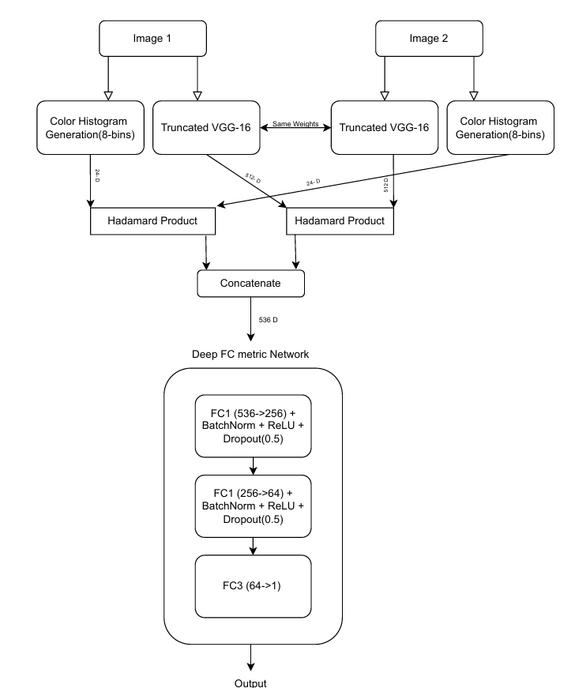
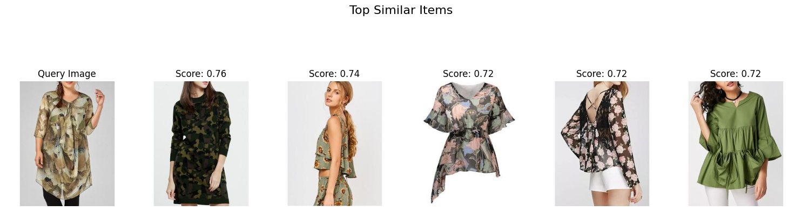
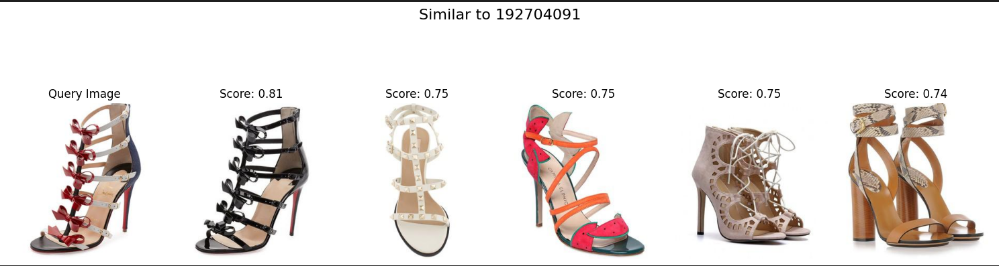
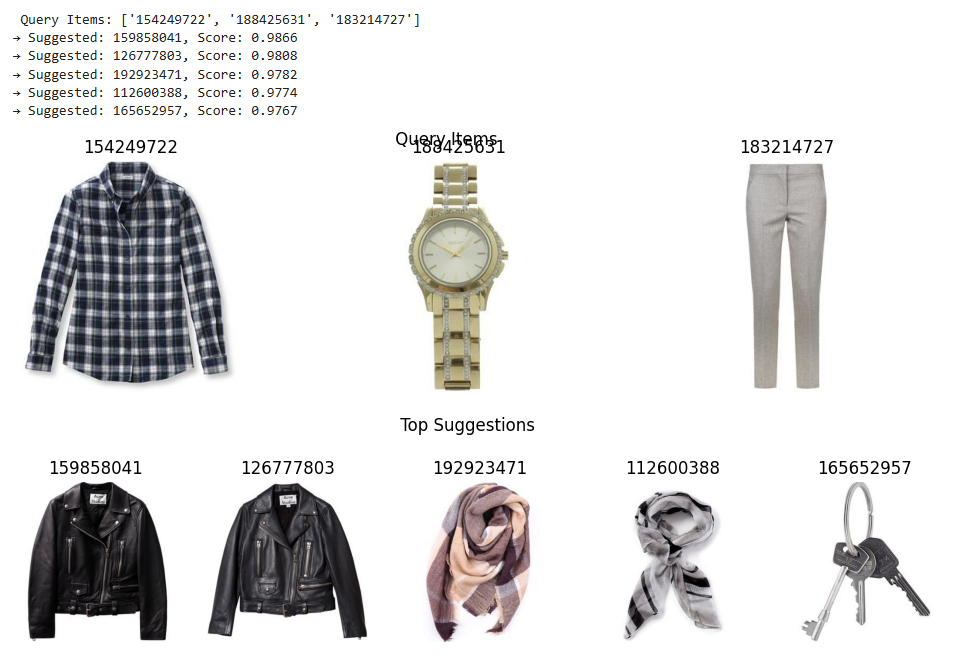
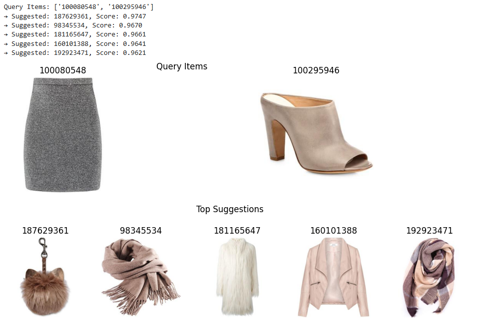
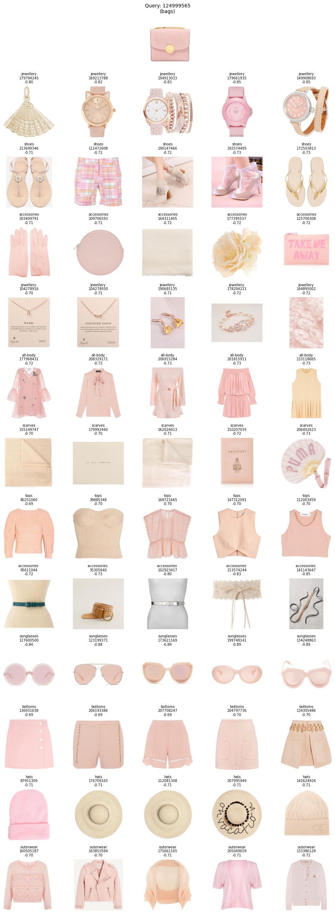

# ML_Fashion_Item_Retrieval

A machine learning-powered fashion recommendation system that suggests **similar** and **complementary** items based on a query image. This project helps small fashion businesses offer personalized stylistic recommendations using deep learning.

---

## Problem Statement

Fashion e-commerce platforms often struggle with providing style-aware recommendations. This project aims to bridge that gap by:
- Recommending **visually similar** fashion items.
- Suggesting **stylistically compatible** combinations (e.g., matching shoes for a dress).

---

## Objective

- Generate visually **similar items** using feature-based image comparison.
- Recommend **complementary items** using both:
  - A trained CompatibilityMLP
  - A **Siamese-based compatibility model** (PolaniaNet) inspired by academic research

---

## Dataset

- **Name**: [Polyvore Outfit Dataset (non-disjoint)](https://github.com/xthan/polyvore-dataset)
- **Alternative Source**: [Kaggle Mirror](https://www.kaggle.com/datasets/enisteper1/polyvore-outfit-dataset)
- **Files Used**: `train.json`, `test.json`
- **Images**: `.jpg` files for each fashion item
- **Outfit Format**: Each outfit is a curated group of items that go well together.

---

## Technologies Used

- **Language**: Python
- **Frameworks**: PyTorch, TorchVision
- **Tools**: Kaggle Notebook, NumPy, OpenCV
- **Models**:
  - ResNet50 (pre-trained)
  - CompatibilityMLP (Self-trained)
  - PolaniaNet (Siamese compatibility model trained with 5000 outfit sets)
- **Hardware**: 
  - CPU: Intel Core i7  
  - RAM: 16GB  
  - GPU: NVIDIA RTX 3060

---

##  Similarity Search

### Steps:
1. **Extract image features** using pre-trained **ResNet50**  
2. **Generate embeddings**: 2048-dim vector for each image  
3. **Calculate cosine similarity** between query and dataset  
4. **Return top-K visually similar items**

---

##  Compatibility Recommendation

### 1. Compatibility MLP

#### Steps:
- Create triplets from outfit data: `(anchor, positive, negative)`
- Generate pairwise embeddings
- Train Compatibility MLP using binary classification

#### MLP Architecture:
- Input: Two 2048-d vectors → concatenate → 4096-d
- Linear (4096 → 512) → ReLU  
- Linear (512 → 1) → Sigmoid  
- Output: Compatibility score (0–1)

---

### 2. Siamese Compatibility Network (PolaniaNet)

#### Based on the Paper:
**“Learning Fashion Compatibility Across Apparel Categories for Outfit Recommendation”**

> This paper proposes a cross-category compatibility learning model using a Siamese network architecture, Hadamard product fusion, color histograms, and a Compatibility Scoring Network trained on curated outfit data.

#### 3. PolaniNet Custom Implementation:
-Module architecture:

-**Siamese-Merge Module**
- Shared *VGC-16 encoder** to extract 512-d embeddings for each item
- **Hadamard product** of embeddings is computed to capture element-wise interaction
- **Color histograms** (8-bin per channel RGB, 24-d vector) are extracted and concatenated
- Final vector: `[512 ⊙ 512] + [24 ⊙ 24] = 536-d`
- Passed through a **Metric Network**:
  - FC1(536->256) + BatchNorm + reLU + Dropout(0.5)  
  - FC2(256->64) + BatchNorm + reLU + Dropout(0.5)
  - FC3(64->1)  
- **CustomMAP loss function**: combines Binary Cross-Entropy with three regularization terms: a Matrix-Normal Prior for structured weight regularization, CNN Sparsity Prior to enforce compact filter representations, and a Classifier Sparsity Prior to enhance feature selection—altogether encouraging generalization and interpretability in compatibility learning
- Output: Compatibility score.

#### Advantages Over Base MLP:
Uses **element-wise fusion (Hadamard product)** for fine-grained compatibility  
Incorporates **color-based features** to improve outfit coherence  
Better **cross-category generalization**

#### Files:
- Training: `polania-5000.py`  
- Testing: `polania-5000test.py`

#### Dataset:
- **Polyvore Outfit Dataset (non-disjoint)** used 4000 curated outfit sets for training and a 1000 curated outfits for validation.

---

## Results

### Similarity Search:
- Retrieves items that match visually in **color**, **texture**, and **style**
- Great for same-category alternatives (e.g., shirts similar to the query shirt)

**Example Output:**



---

### Compatibility Recommendation:

#### Compatibility MLP:
- Learns binary compatibility from concatenated embeddings
- Outputs a score indicating whether two items go together
**Example Output:**



#### Siamese Compatibility (PolaniaNet):
- Learns **cross-category compatibility**
- Incorporates both **deep features** and **color histograms**
- Significantly outperforms basic MLP for outfit-level recommendations

**Example Output:**


---

## Model Weights

The trained weights for both compatibility models are available for quick inference.

- **Compatibility MLP File**: `compact_model.pt`  
- **Siamese Compatibility Model Files**: [Kaggle Models – PolaniaNet 5000](https://www.kaggle.com/models/amishalalwani3110/polania_5000)

---

##Presentations:
1-CompatibliyMLP & Similarity search: https://github.com/Lalwaniamisha789/Fashion__Compatibility_Recommender/blob/0fad2d1c3ff461d082908a89ec4f701e0cd8590c/Presented_by_TechBandus%5B1%5D.pptx_compressed.pdf
2- PolaniaNet: https://github.com/Lalwaniamisha789/Fashion__Compatibility_Recommender/blob/0fad2d1c3ff461d082908a89ec4f701e0cd8590c/Ivory%20Black%20Simple%20Geometric%20Research%20Project%20Presentation.pdf

---

## Loading Pretrained Compatibility MLP

```python
from model import CompatibilityMLP 
import torch

# Initialize the model
compat_model = CompatibilityMLP()

# Load saved weights
compat_model.load_state_dict(torch.load("models/compact_model.pt", map_location=torch.device('cpu')))

# Set model to evaluation mode
compat_model.eval()
