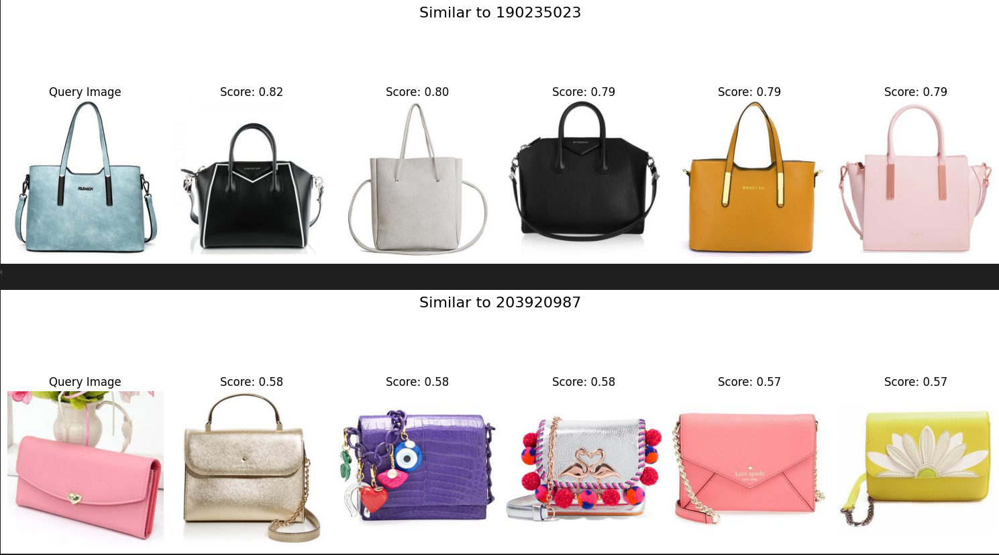
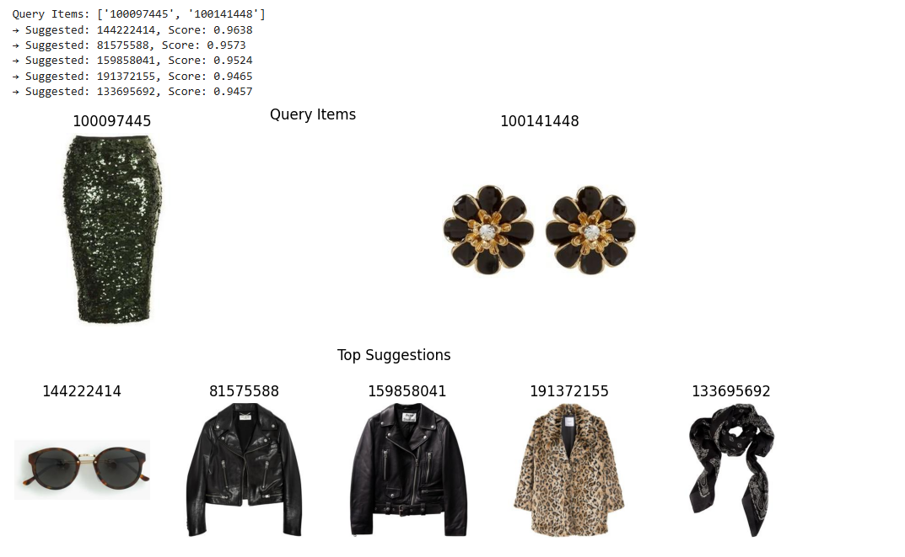

# ML_Fashion_Item_Retrieval

A machine learning-powered fashion recommendation system that suggests **similar** and **complementary** items based on a query image. This project helps small fashion businesses offer personalized stylistic recommendations using deep learning.

---

## Problem Statement

Fashion e-commerce platforms often struggle with providing style-aware recommendations. This project aims to bridge that gap by:
- Recommending **visually similar** fashion items.
- Suggesting **stylistically compatible** combinations (e.g., matching shoes for a dress).

---

## Objective

- Generate visually **similar items** using feature-based image comparison.
- Recommend **complementary items** using a trained model for fashion compatibility.

---

## Dataset

- **Name**: [Polyvore Outfit Dataset (non-disjoint)]([https://github.com/xthan/polyvore-dataset](https://www.kaggle.com/datasets/enisteper1/polyvore-outfit-dataset))
- **Files Used**: `train.json`, `test.json`
- **Images**: `.jpg` files for each fashion item
- **Outfit Format**: Each outfit is a curated group of items that go well together.

---

## Technologies Used

- **Language**: Python
- **Frameworks**: PyTorch, TorchVision
- **Tools**: Kaggle Notebook, NumPy, OpenCV
- **Model**: ResNet50 (pre-trained), CompatiblityMLP (Self-Trained)
- **Hardware**: 
  - CPU: Intel Core i7  
  - RAM: 16GB  
  - GPU: NVIDIA RTX 3060

---

## Similarity Search

### Steps:
1. **Extract image features** using pre-trained **ResNet50**  
2. **Generate embeddings**: 2048-dim vector for each image
3. **Calculate cosine similarity** between query and dataset
4. **Return top-K visually similar items**

---

## Compatibility Recommendation

### ➤ Steps:
1. **Create triplets** from outfit data: `(anchor, positive, negative)`
2. **Generate pairwise embeddings**
3. **Train Compatibility MLP** using binary classification

### Compatibility MLP Architecture:
- Input: Two 2048-d vectors → concatenate → 4096-d
- Linear (4096 → 512) → ReLU  
- Linear (512 → 1) → Sigmoid  
- Output: Compatibility score (0–1)

---
## 📸 Results

### ✅ Similarity Search:
- Retrieves items that match visually in **color**, **texture**, and **style**
- Great for same-category alternatives (e.g., shirts similar to the query shirt)

**Example Output:**

---

### ✅ Compatibility Recommendation:
- Outputs complementary items (e.g., shoes for a dress)
- Learns **cross-category compatibility** for coherent outfit generation

**Example Output:**

